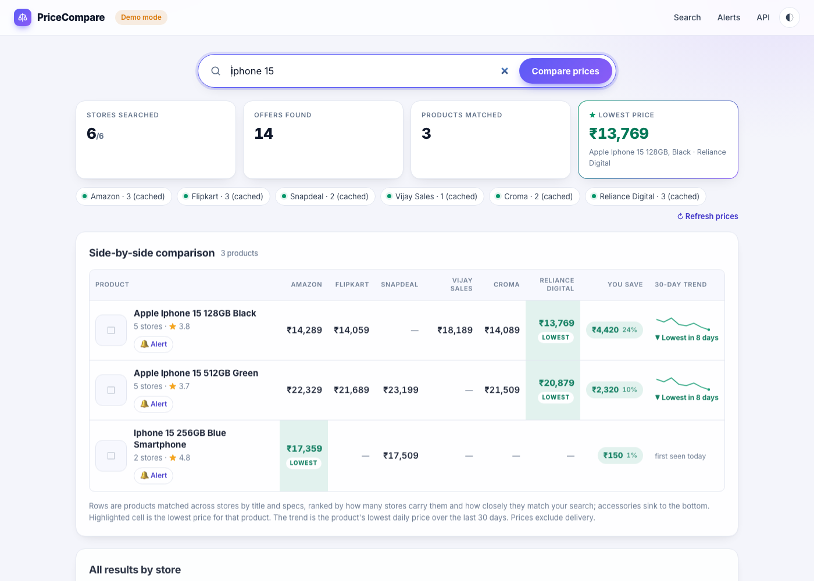
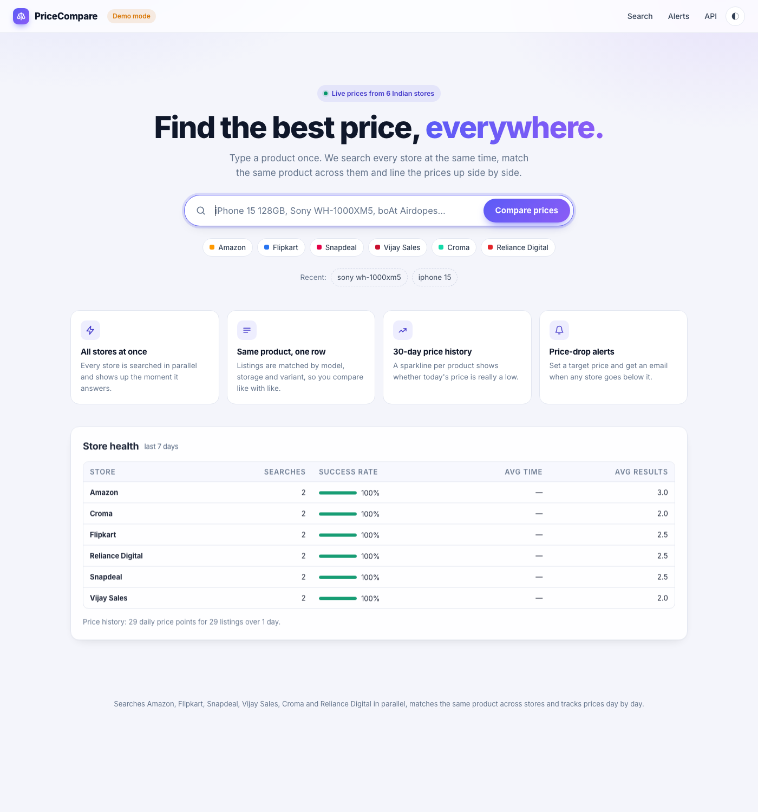
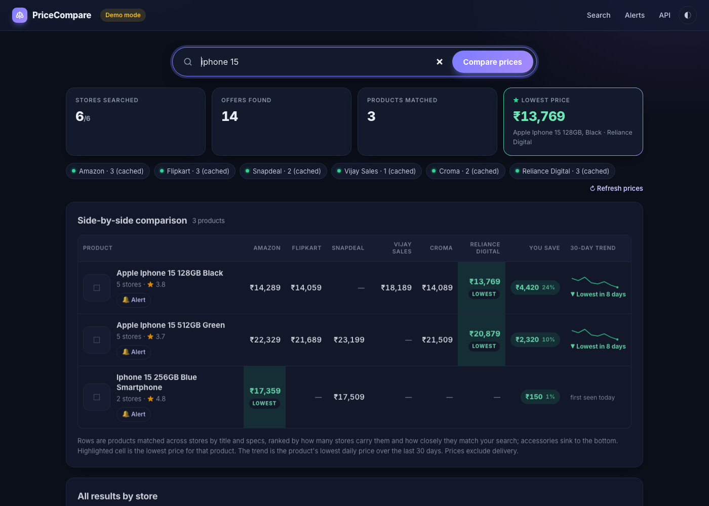
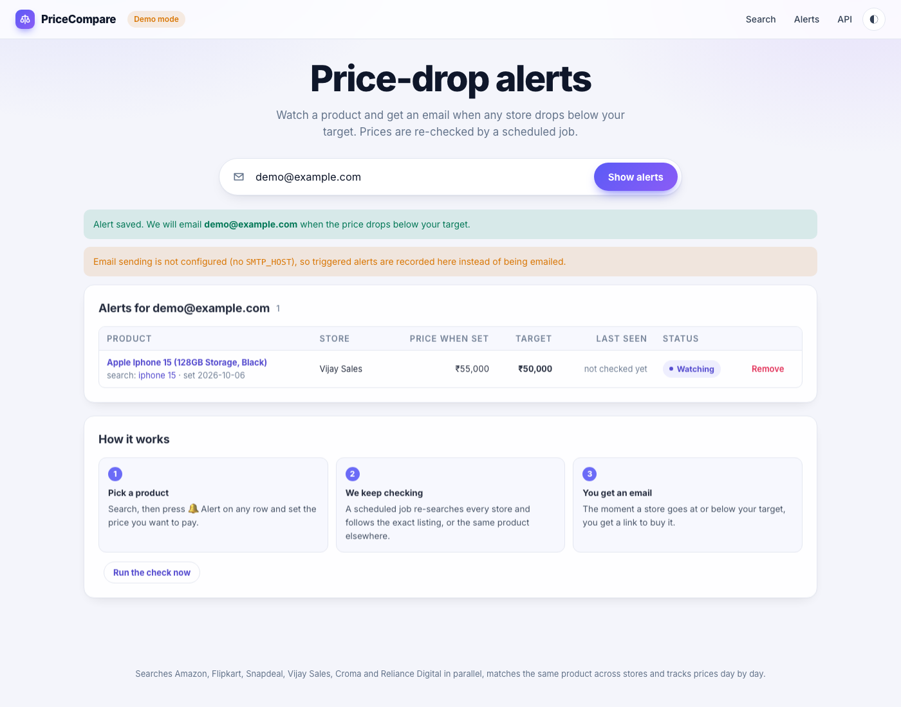

# PriceCompare

Type a product name once. PriceCompare searches **Amazon, Flipkart, Snapdeal, Vijay Sales,
Croma and Reliance Digital** at the same time, works out which listings are the same product,
shows the prices side by side with the cheapest highlighted, tracks each product's price day
by day, and emails you when a product drops below the price you want.

```
iphone 15  ──►  Amazon   Flipkart   Snapdeal  Vijay Sales  Croma   Reliance  You save   30-day trend
iPhone 15 128GB Black   ₹69,900  ₹66,999 ★   ₹68,490    ₹70,499   ₹69,900  ₹59,900 ★  ₹10,599 (15%)  ▁▂▃▂▁ lowest in 30 days
iPhone 15 256GB Blue    ₹79,900  ₹76,999 ★      —          —       ₹79,900     —       ₹2,901 (4%)   ▃▃▂▂▂ 30-day low ₹76,999
```

Live copy: https://price-compare-alpha-lime.vercel.app



<details><summary>More screenshots (home, dark mode, alerts, mobile)</summary>





</details>

## Run it

```bash
make install            # virtualenv + dependencies
make demo               # http://localhost:8000  simulated stores: works offline, good for presentations
make dev                # real scraping
make test               # 69 offline tests (saved store pages, mock stores)
make eval               # matcher accuracy on the labelled pairs (precision / recall / F1)
make alerts             # run the price-drop checker once
```

Copy `.env.example` to `.env` to change the cache lifetime, results per store, switch demo
mode on, add a scraping proxy, or configure email for alerts.

## What it does

1. **Parallel search.** Every store adapter fetches results (HTML for Amazon, Flipkart and
   Snapdeal; the JSON search services behind Vijay Sales and Croma; the page state embedded by
   Reliance Digital), retries on transient errors, and parses listings into a common `Offer`
   (store, title, price, url, image, rating). A thread pool runs all stores at once.
2. **Progressive loading.** The results page renders immediately and the browser fetches each
   store separately (`/fragment/store/<name>`). Columns fill in as stores answer, with a
   progress bar; when the last one arrives, the browser posts everything to
   `/fragment/compare`, which groups the offers and returns the comparison table. Fast stores
   show up in a second or two instead of waiting for the slowest. When every store is already
   cached, the page is rendered server-side in one go.
3. **Resilience.** A store that blocks, times out or changes its HTML fails on its own. Its
   column shows the reason and the other stores still render.
4. **Matching and ranking.** Titles are normalised ("128 GB" becomes `128gb`, "Pro+" becomes
   `pro plus`, filler words removed) and compared with Jaccard similarity over the word sets.
   Guards stop wrong merges: storage/RAM, battery, wattage and weight must agree (a listing that
   omits RAM still matches, 8GB vs 16GB does not), screen sizes must be within 1.5 inches
   (stores round cm and inches differently), variant words (Pro, Max, Plus, Ultra, Air, FE...)
   and model numbers (15 vs 16, Flip 5 vs Flip 6, 2331 vs 2332, S24 vs S23) must agree. Shared
   model codes ("WH-1000XM5", "G502") link listings whose wording differs completely. A
   character-level fuzzy score (rapidfuzz) rescues pairs just under the threshold when the
   normalised titles are nearly the same string ("Fire-Boltt" vs "Fire Boltt", "Smart Watch" vs
   "Smartwatch") and breaks ties. Greedy clustering, cheapest first, produces one row per
   product. Accessories (cases, chargers) sink to the bottom; rows are ranked by match quality,
   then by how many stores carry the product.
5. **Side-by-side table.** One column per store, the lowest price per row highlighted, the
   saving between the most and least expensive store, and a 30-day sparkline per product.
6. **Price history.** Every live result is recorded once per day per listing. Each row shows
   the product's lowest daily price over the last 30 days and flags "lowest in N days" when
   today's price is the minimum. `/api/history?q=` returns the series as JSON.
7. **Price-drop alerts.** Click **🔔 Alert** on any row, enter an email and a target price.
   A scheduled job (`make alerts`, or Vercel Cron hitting `/api/alerts/run` daily) re-searches
   the watched products, finds the exact listing or the same product in another store, and
   emails you (SMTP settings in `.env`) when the price is at or below your target. Without SMTP
   configured the trigger is recorded on the `/alerts` page instead, so the flow can be
   demonstrated offline.
8. **Cache and health.** Results are cached in SQLite for three hours so repeat searches are
   instant and the stores are not hammered. Every live search is logged, which powers the
   store-health table (success rate, average time, average results).

## Matching accuracy

`evaluation/pairs.csv` holds 78 hand-labelled pairs of real listing titles (40 same product,
38 different: storage tiers, Pro/Plus/Ultra variants, model generations, accessories, screen
and case sizes, "Pro+" spelling, split words). `make eval` runs the matcher on each pair and
reports whether the two listings land in one row.

| Matcher                      | Precision | Recall | F1    | Accuracy | False merges | Missed |
|------------------------------|-----------|--------|-------|----------|--------------|--------|
| Jaccard + spec guards        | 92.5%     | 92.5%  | 92.5% | 92.3%    | 3            | 3      |
| + fuzzy tiebreaker (shipped) | 92.7%     | 95.0%  | 93.8% | 93.6%    | 3            | 2      |

Before the guards added for this evaluation (single-digit and four-digit model numbers,
RAM+storage subset rule, screen-size tolerance, "with MagSafe Case" not being an accessory) the
same matcher scored 80.8% accuracy on the same pairs. The remaining mistakes are listed by
`make eval`; they are cases where the only difference is a product-line word ("MX Master" vs
"MX Anywhere", "Disc" vs "Digital Edition") or a brand name split into a variant word ("Air
dopes"). `tests/test_evaluation.py` fails if precision or recall drop below 90%.

## Project layout

```
app/
  main.py          routes: /  /fragment/store/<name>  /fragment/compare  /alerts  /api/search  /api/history  /api/health  /api/alerts/run
  search.py        cache -> stores -> grouping -> history; single-store and full searches
  matching.py      title normalisation, spec/variant/model guards, Jaccard + fuzzy grouping
  cache.py         SQLite: result cache, search log, daily price history, alerts
  alerts.py        price-drop checker (python -m app.alerts)
  notifier.py      email via SMTP, or log when not configured
  config.py        environment settings
  stores/
    base.py        Offer (+ canonical listing key), fetch_html, parse helpers, BaseStore
    amazon.py  flipkart.py  snapdeal.py  vijaysales.py  croma.py  reliancedigital.py
    mock.py        simulated stores for demos
    registry.py    STORES list + concurrent search
  templates/       index.html (progressive loader), _results.html, _column.html, alerts.html
  static/          CSS
evaluation/        pairs.csv (labelled title pairs) + evaluate.py
tests/             pytest + fixtures/ (saved search pages and API responses)
```

## Hosting notes

The live copy runs on Vercel. Two things to know:

- Stores block datacenter IPs, so the hosted copy routes HTML fetches through a scraping proxy
  (`SCRAPER_API_KEY`). Without it, Amazon, Flipkart, Snapdeal and Croma fail with HTTP 403/503.
- On Vercel only `/tmp` is writable, and it is wiped whenever the function instance is
  recycled. The cache, price history, store-health stats and alerts therefore do not survive
  restarts on the hosted copy. Locally (and with Docker, which mounts a volume) everything
  persists. Moving `cache.py` to a hosted Postgres or Redis is the next step for durable
  history and alerts in production.
- `vercel.json` schedules `/api/alerts/run` daily; Vercel sends `Authorization: Bearer
  $CRON_SECRET`, so set `CRON_SECRET` in the project's environment.

## Adding a store

```python
# app/stores/example.py
from bs4 import BeautifulSoup
from .base import BaseStore, Offer, parse_price

class ExampleStore(BaseStore):
    name, label, base_url = "example", "Example", "https://www.example.in"

    def search_url(self, query):
        return f"{self.base_url}/search?q={self.q(query)}"

    def parse(self, html):
        soup = BeautifulSoup(html, "lxml")
        out = []
        for item in soup.select(".product-item"):
            title, price, link = item.select_one(".title"), item.select_one(".price"), item.select_one("a[href]")
            if title and price and link and parse_price(price.get_text()):
                out.append(Offer(self.name, title.get_text(strip=True), parse_price(price.get_text()), self.absolute(link["href"])))
        return out
```

Register it in `app/stores/registry.py` (`STORES`), add a saved search page under
`tests/fixtures/` and a parse test, and give `app/stores/mock.py` a title format for demo mode.

## Known limitations

- Scraping is fragile by nature: a store changing its markup breaks its adapter until the
  selectors are updated. Each adapter has an offline test against a saved page so breakage is
  caught quickly.
- Prices exclude delivery charges and bank offers.
- Matching is heuristic. The evaluation above shows where it fails; a learned matcher trained
  on the labelled pairs is a natural extension.
- Croma's search service rejects most non-residential IPs, so it only works through the proxy.
